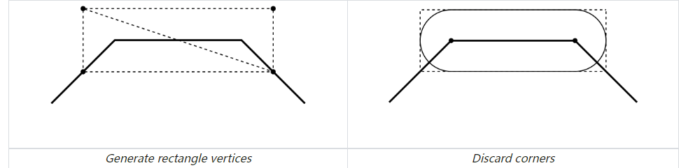
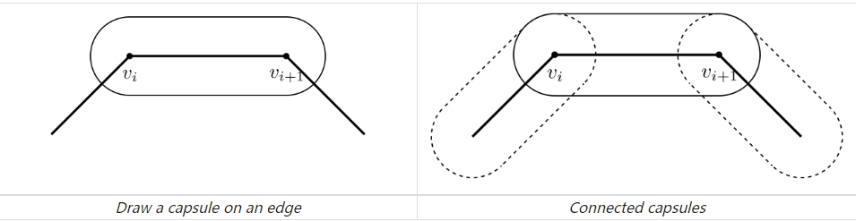
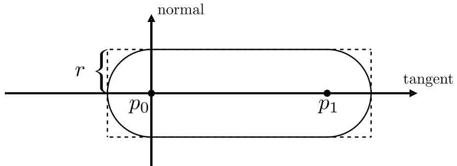
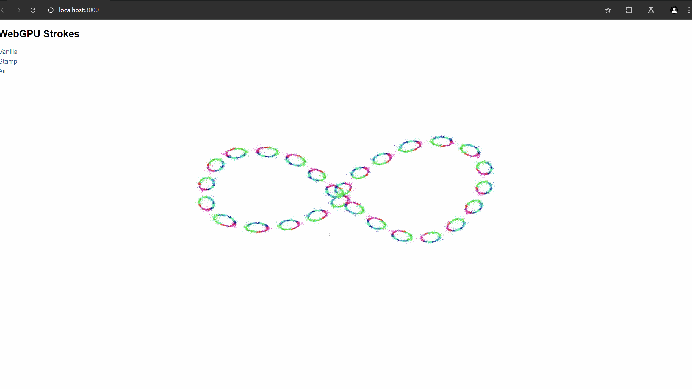

# WebGPU-based-Stroke-Rendering
**University of Pennsylvania, CIS 565: GPU Programming and Architecture, Final Project**  
**Team Members:** Yifan Lu, Catherine Cheng, Annie Qiu

## Introduction

Our project delivers a GPU-accelerated platform for expressive vector-based digital art, offering real-time rendering, variable-width strokes, and seamless integration on WebGPU.

The project is based on the 2024 SIGGRAPH paper *Ciallo: GPU-Accelerated Rendering of Vector Brush Strokes*. Our goal is to overcome the limitations found in the original Ciallo implementation, enabling artists to explore intricate details without losing texture quality. By integrating the VTracer open-source project, we ensure that artists can work seamlessly at any level of detail.

## Demo Results

## How to Run
1. **Check WebGPU Compatibility:** Ensure your browser supports WebGPU.
2. **Install Dependencies:** Run `npm install`.
3. **Add dat.gui:** Drag dat.gui into your node_modules directory.
4. **Start the Application:** Run `npm run dev`.

## Core Feature: GPU-based Brush Rendering
Current vector painting software often suffers from a limited selection of brush types and noticeable performance lags. Our program addresses these challenges by enabling the efficient rendering of diverse digital brushes.

### Vanilla Strokes

#### Concept Overview
Vanilla strokes create smooth, capsule-like shapes between consecutive vertices along a polyline. Each edge of the polyline consists of two components:
- **Joints:** Circular regions centered at the vertices.
- **Bones:** The trapezoidal area connecting the joints seamlessly.

#### Implementation
- **Joint and Bone Geometry:**
  - For each edge defined by two vertices \(v_0\) and \(v_1\), calculate two circular joint areas based on their positions and radii.
  - Generate a trapezoid connecting the circles. Discard pixels at the corners to create a capsule shape.
  
  
- **Trapezoid Construction:**
  - Compute the tangent and normal directions from \(v_0\) to \(v_1\).
  - Define the trapezoid corners using trigonometric calculations for accurate alignment.
   
- **Rendering:**
  - Use geometry shaders for desktop applications or instanced rendering for the web.
  - Each polyline edge is rendered as an instance, with local coordinates transformed using vertex shaders.
- **Transparency Handling:**
  - Combine joint and bone transparency using a mathematical blending equation.

---

### Stamp Strokes

#### Concept Overview
Stamp-based stroke rendering uses a texture, often referred to as a "stamp texture" or "footprint." As the user paints, this texture is repeatedly rendered along the brushstroke path, spaced evenly. When placed close enough together, these stamps create the illusion of a continuous stroke.

#### Implementation
- **Parallel Processing:**
  - Calculate the prefix sum of edge lengths using a compute shader to determine distances along the polyline.
  - Pass these values to the fragment shader to dynamically compute stamp positions.
- **Stamp Placement:**
  - Place stamps equidistantly along each edge.
  - Compute the local segment within which a stamp can influence a pixel, reducing unnecessary calculations.
- **Texture Sampling:**
  - For each pixel, sample only stamps within the segment.
  - Use the distance from the pixel to the stamp's center and its radius to determine texture coordinates.

---

### Airbrush Strokes

#### Concept Overview
Airbrush strokes resemble solid vanilla strokes but with a transparency gradient from the central axis to the rim. This creates a soft, continuous appearance similar to traditional airbrushing techniques. The transparency is modeled mathematically to avoid over-sampling while maintaining visual fidelity.

#### Implementation
- **GPU Implementation:**
  - Place vertex positions and radii in buffers.
  - Use vertex shaders for geometry setup and fragment shaders for blending calculations.
  - Apply transparency blending to simulate the gradual fade from the center to the edges of the stroke.

---

## User Interface
Our application provides an intuitive and versatile user interface designed to cater to both novice and experienced digital artists. The following features are included to enhance usability and creative flexibility:

### Stroke Customization:
Change the color of your strokes to achieve the desired artistic effect.

  

Adjust the width of the stroke for varying line weights and styles.
	
### Custom Stamp Textures:
Upload your own stamp texture maps to personalize and diversify your strokes.

### Stroke Types:
Choose from three stroke styles:
Vanilla Stroke: Smooth, capsule-shaped strokes.
Stamped Stroke: Texture-based strokes for dynamic and textured appearances.
Airbrush Stroke: Soft strokes with transparency gradients for a traditional airbrushing effect.
Use the eraser tool to correct or remove strokes effortlessly.

  

### Canvas Export and Import:
Export your current canvas as an SVG graphic for vector editing or sharing.
Save your work as a preset file, akin to a PSD file in Photoshop, and reload it later to continue working seamlessly.
Editing Tools:
Undo: Revert the most recent stroke for iterative editing.
Clear Canvas: Reset the canvas to start anew.

## Progress
[Pitch Slides](https://docs.google.com/presentation/d/1kdWUWK_J51V1OK4vAgOqVRj1v4jI2E21javRQpv6LB8/edit?usp=sharing)

[Milestone 1 Slides](https://docs.google.com/presentation/d/1Zq7IuN5DZT85qdESfEUQTyffL5LvHAezVL_pzlStI3o/edit?usp=sharing)

[Milestone 2 Slides](https://docs.google.com/presentation/d/1T2Zvy6Y7YE-2VomaqhQ14VG_lq6AovSEm9_g_u48H_o/edit?usp=sharing)

[Milestone 3 Slides](https://docs.google.com/presentation/d/1iS7UCDXDNgcz1sXsQtlMUnTq7uBP9yh2huFh2rZW6gE/edit?usp=sharing)

## Credits
[Orillusion](https://github.com/Orillusion/orillusion-webgpu-samples)

[Ciallo](https://dl.acm.org/doi/10.1145/3641519.3657418)
